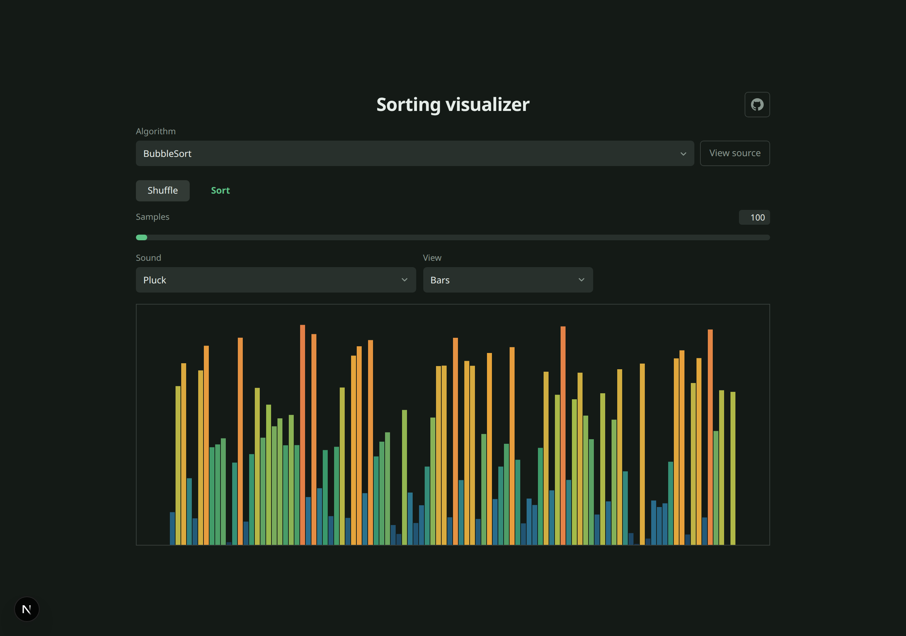
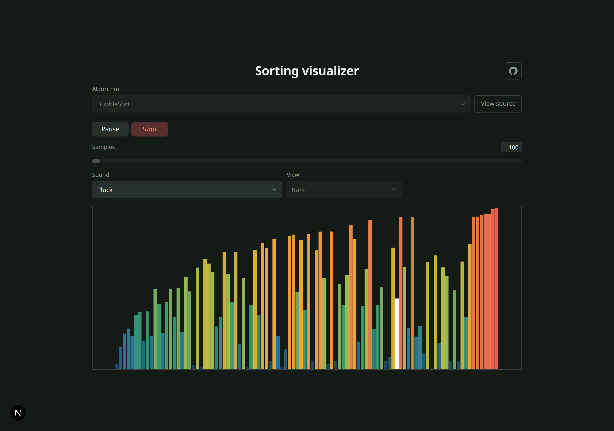
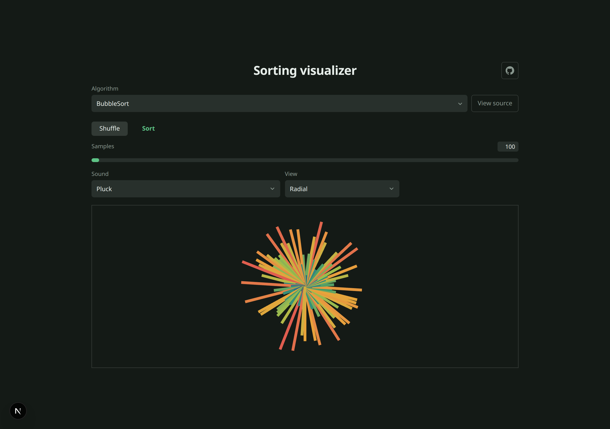
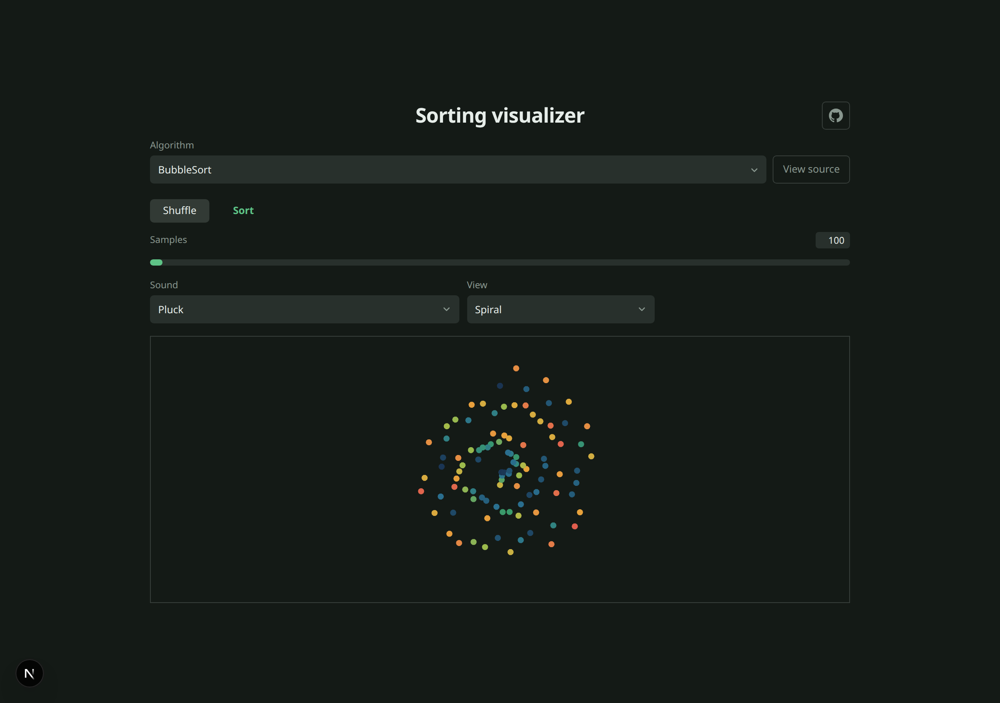
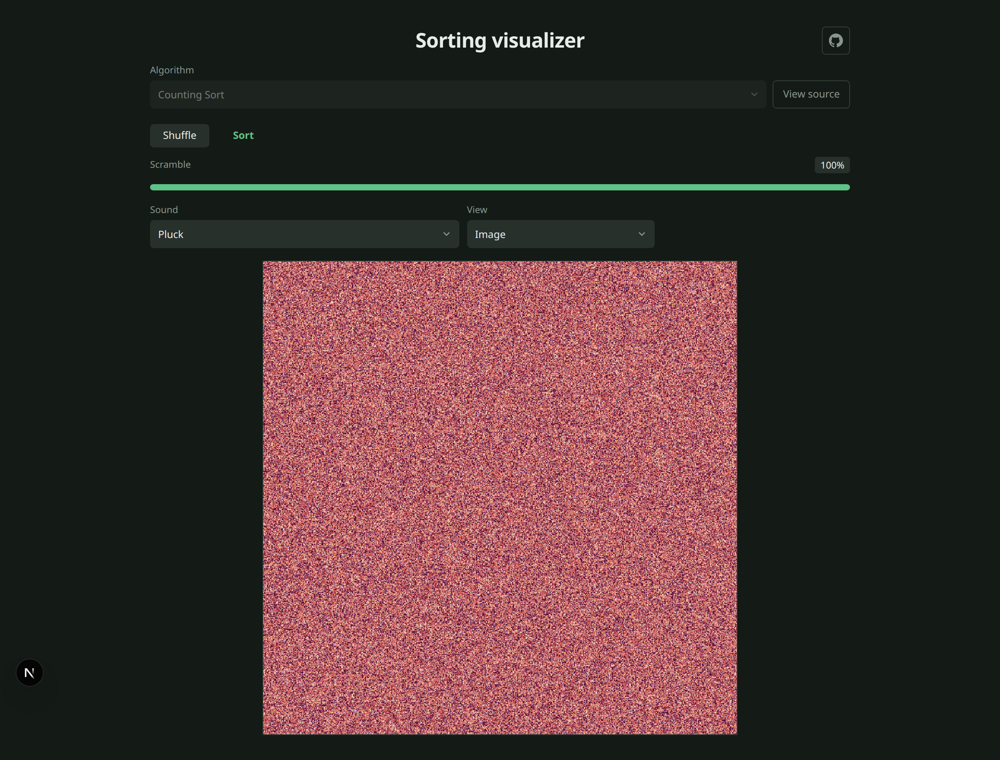
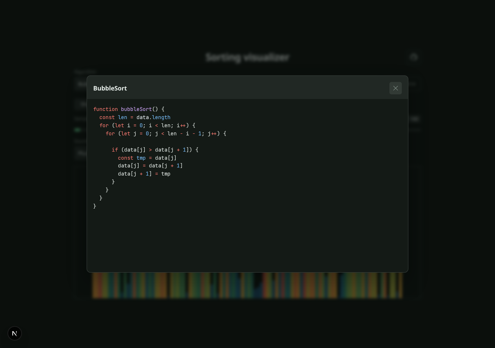

# Sorting Visualizer

Welcome to Sorting Visualizer.

I built this application after watching [**15 Sorting Algorithms in 6 Minutes**](https://www.youtube.com/watch?v=kPRA0W1kECg) on YouTube, which shows sorting algorithms in action with real-time sound effects.

I thought it would be cool to do something similar in React, but with a twist: keep the algorithms as separated from the presentation layer as possible — close to raw sorting logic, not buried inside UI components. And do all of that in Next.js, deployed on Vercel.

The solution was to use **Web Workers** for calculation on a separate thread, store sorted data, markers, and control flags in a **SharedArrayBuffer**, and let the main thread react only when data changes. That way we squeeze out performance without pushing sorting logic into React components. With the shared buffer we do not have to copy data from worker to main thread on every step — just a notification that something updated.

The presentation layer is built with **Three.js / React Three Fiber**, rendering instanced geometry based on the current data state.

On top of that I added a small **sound engine** that plays a tone for the currently accessed or swapped element, plus a **source view** that renders the preprocessed sorting implementation with syntax highlighting.

## Live demo

[https://sortingvis.kkucharski.com/](https://sortingvis.kkucharski.com/)

## Screenshots

| Bars | Sorting in action |
| --- | --- |
|  |  |

| Radial | Spiral |
| --- | --- |
|  |  |

| Image mode | Source code |
| --- | --- |
|  |  |

Screenshots are generated automatically — see [Regenerating screenshots](#regenerating-screenshots).

## Features

**Algorithms**

- Merge sort
- Bubble sort
- Insertion sort
- Quick sort
- Cocktail shaker sort
- Counting sort (image mode)

**Visual modes**

- Bars, sticks, dots, bricks
- Radial, spiral, heatmap
- Image — sort pixels of a sample image

**Sound modes**

- Tone, sine, chip, buzz, pluck, noise
- Off

**Other**

- Shuffle / sort / pause / stop controls
- Adjustable sample count
- View syntax-highlighted worker source for each algorithm
- GitHub link in the app header

## Tech stack

- Next.js
- React Three Fiber + Three.js
- Web Workers + SharedArrayBuffer
- Web Audio API
- Starry Night for syntax highlighting

## Development

```bash
pnpm install
pnpm dev
```

Open [http://localhost:3002](http://localhost:3002).

```bash
pnpm build   # static export
pnpm preview # serve the exported build locally
```

## Regenerating screenshots

Install Chromium for Playwright once:

```bash
pnpm screenshots:install
```

Then generate all README screenshots:

```bash
pnpm screenshots
```

The script starts a local dev server, drives the UI with Playwright, and writes images to `docs/screenshots/`.

If you already have `pnpm dev` running, reuse it:

```bash
SCREENSHOT_BASE_URL=http://localhost:3002 pnpm screenshots
```

Capture a single screenshot:

```bash
pnpm screenshots bars.png
```

## License

MIT
